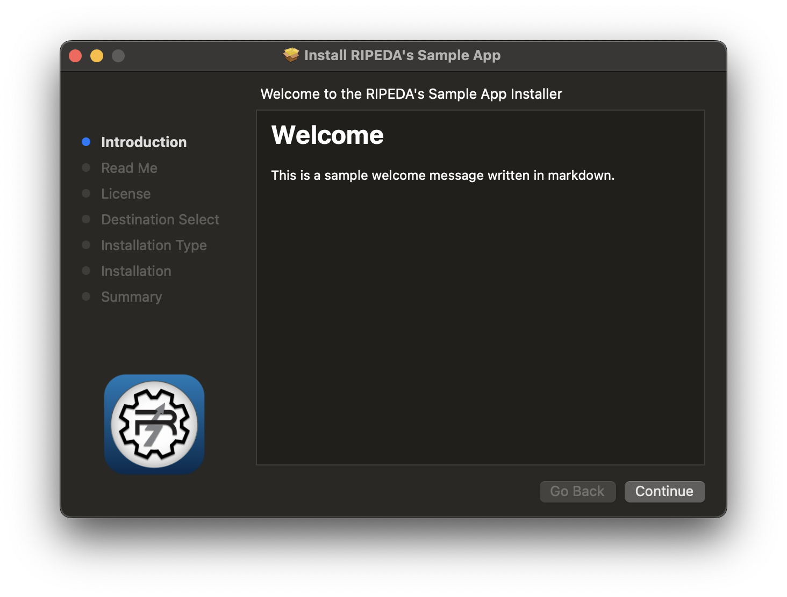

# macOS-Pkg-Builder

Python module for creating macOS packages more easily through native tooling (pkgbuild and productbuild). Primarily developed as an alternative to [WhiteBox's Packages](http://s.sudre.free.fr/Software/Packages/about.html) for easier CI/CD integration.

* [GitHub](https://github.com/ripeda/macOS-Pkg-Builder)
* [PyPi](https://pypi.org/project/macos-pkg-builder)


## Usage

Installation:
```bash
# Requires Python 3.6+ and macOS host with pkgbuild and productbuild available
pip3 install macos-pkg-builder
```

Sample invocation:
```py
from macos_pkg_builder import Packages

pkg_obj = Packages(
    pkg_output="Sample.pkg",
    pkg_bundle_id="com.myapp.installer",
    pkg_preinstall_script="Samples/MyApp/MyPreinstall.sh",
    pkg_postinstall_script="Samples/MyApp/MyPostinstall.sh",
    pkg_file_structure={
        "Samples/MyApp/MyApp.app": "/Applications/MyApp.app",
        "Samples/MyApp/MyLaunchDaemon.plist": "/Library/LaunchDaemons/com.myapp.plist",
    },
)

assert pkg_obj.build() is True
```

Supported classes:
* `Packages` - For building single packages, either flat or distribution.
  * Recommended for most use cases. Internally uses `FlatPackage` and `DistributionPackage` classes.
* `FlatPackage` - For building flat packages.
* `DistributionPackage` - For building distribution packages.


Format of `Packages` constructor:
```py
"""
    pkg_output:             Path to where the package will be saved.
                            Required.

    pkg_bundle_id:          Bundle ID of the package.
                            Required.

    pkg_version:            Version of the package.
                            Default: 1.0.0
                            Optional.

    pkg_install_location:   Location where the package will be installed.
                            Default: /
                            Optional.

    pkg_allow_relocation:   Allow the embedded application to be installed where the user has an existing copy (outside expected install location)
                            Requires a valid bundle to be provided in 'pkg_file_structure' (ex. app, plugin, etc.)
                            Default: True
                            Optional.

    pkg_file_structure:     File structure of the package.
                            Configured as a dictionary, where the key is the source file and the value is the destination.
                            Default: None
                            Optional if preinstall or postinstall scripts are provided.

    pkg_preinstall_script:  Path to the preinstall script.
                            Default: None
                            Optional.

    pkg_preflight_script:   Path to the preflight script.
                            Default: None
                            Optional.

    pkg_postinstall_script: Path to the postinstall script.
                            Default: None
                            Optional.

    pkg_postflight_script:  Path to the postflight script.
                            Default: None
                            Optional.

    pkg_script_resources:   List of additional scripts to be included in the package.
                            This is primarily for pre/postinstall scripts that need additional resources present next to them.
                            ex. Shipping 'desktoppr' with a wallpaper, and have the postinstall script set the wallpaper.
                            Default: None
                            Optional.

    pkg_signing_identity:   Signing identity to use when signing the package.
                            If missing, no signing will be performed.
                            Default: None
                            Optional.

    pkg_as_distribution:    Convert the package to a product archive.
                            Default: False
                            Optional.

    pkg_title:              Title of the distribution package.
                            Default: None
                            Optional. Requires 'pkg_as_distribution' to be True.

    pkg_welcome:            Content of the WELCOME file as markdown.
                            Default: None
                            Optional. Requires 'pkg_as_distribution' to be True.

    pkg_readme:             Content of the README file as markdown.
                            Default: None
                            Optional. Requires 'pkg_as_distribution' to be True.

    pkg_license:            Content of the LICENSE file as markdown.
                            Default: None
                            Optional. Requires 'pkg_as_distribution' to be True.

    pkg_background:         Path to the background image for the distribution package.
                            Default: None
                            Optional. Requires 'pkg_as_distribution' to be True.

    pkg_background_dark:    Path to the dark background image for the distribution package.
                            If not provided, the light background will be used.
                            Default: None
                            Optional. Requires 'pkg_as_distribution' to be True.

    File Structure:
        {
            # Source: Destination
            "~/Developer/MyApp.app": "/Applications/MyApp.app",
            "~/Developer/MyLaunchDaemon.plist": "/Library/LaunchDaemons/com.myapp.plist",
        }
"""
```

## Additional Supported Use Cases

#### Building single-use packages that don't leave tooling behind

Useful for scenarios where you need to ship additional tools, but don't want to run any additional cleanup scripts to remove them.

Below is how to set a wallpaper using Scripting OS X's [desktoppr](https://github.com/scriptingosx/desktoppr):

```py
Packages(
    pkg_output="Sample-Wallpaper.pkg",
    pkg_bundle_id="com.myapp.wallpaper",
    pkg_file_structure={
        "Samples/MyWallpaperConfigurator/Snow Leopard Server.jpg": "/Library/Desktop Pictures/Snow Leopard Server.jpg",
    },
    pkg_preinstall_script="Samples/MyWallpaperConfigurator/PrepareDirectory.sh",
    pkg_postinstall_script="Samples/MyWallpaperConfigurator/SetWallpaper.sh",
    pkg_script_resources=[
        "Samples/MyWallpaperConfigurator/desktoppr",
    ],
)
```

#### Building a simple uninstaller

Useful for when you have a single script you need to execute to remove your application:
```py
Packages(
    pkg_output="Sample-Uninstall.pkg",
    pkg_bundle_id="com.myapp.uninstaller",
    pkg_preinstall_script="Samples/MyUninstaller/MyPreinstall.sh",
)
```

#### Building installers with welcome, readme, licensing and background image

Uses the markdown formatting to provide a more polished installer experience with little effort.

Notes:
* Requires package to be built as a distribution package.
* Optional `pkg_background` parameter to provide a background image for the distribution package.
  * Image recommended to be
  * Optional `pkg_background_dark` parameter to provide a dark mode background image.
    * If not provided, `pkg_background` will be used for both light and dark mode.
* Optional `pkg_title` parameter to provide a title for the distribution package.
  * Configures as follows in the distribution package:
    * Header: `Install {title}`
    * Welcome: `Welcome to the {title} Installer`
* Optional `pkg_welcome`, `pkg_readme` and `pkg_license` parameters to provide markdown content for the respective pages in the distribution package.

```py
Packages(
    pkg_output="Sample-Install.pkg",
    pkg_bundle_id="com.myapp.installer",
    pkg_file_structure={
        "Samples/MyApp/MyApp.app": "/Applications/MyApp.app",
    },
    pkg_as_distribution=True,
    pkg_welcome="# Welcome\n\nThis is a sample welcome message written in markdown.",
    pkg_readme="# Read Me\n\nThis is a sample README written in markdown.",
    pkg_license="# License\n\nThis is a sample license written in markdown.",
    pkg_title="RIPEDA's Sample App",
    pkg_background="Samples/MyApp/MyBackground.png",
),
```

